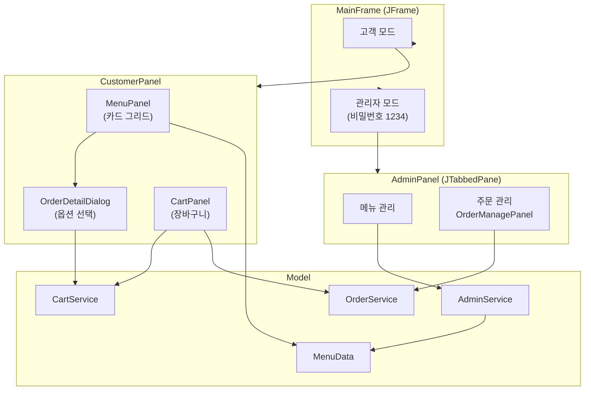
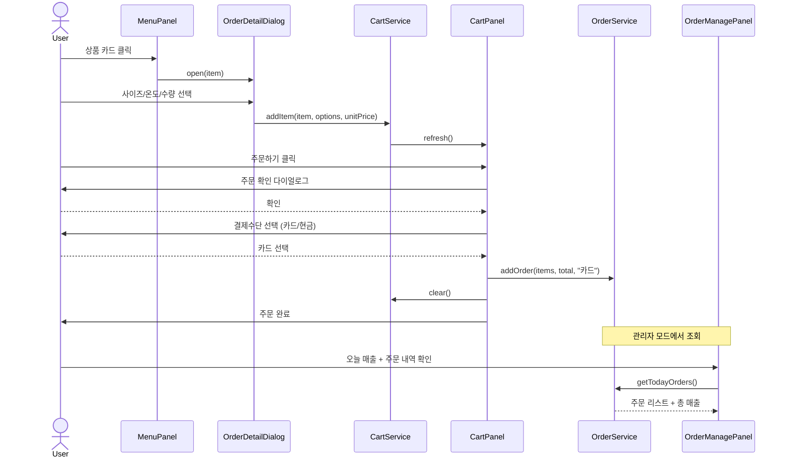

<div align="center">
  <h1>키오스크 (Kiosk)</h1>
  <p>Java Swing (JFrame) 기반 음식 주문 및 매출 관리 키오스크 데스크톱 애플리케이션</p>

  <p>
    <a href="https://openjdk.org"></a>
    <a href="https://docs.oracle.com/javase/tutorial/uiswing/"></a>
    
    
  </p>
</div>

---

## Overview

고객 주문 모드(메뉴 선택, 장바구니, 결제)와 관리자 모드(메뉴 관리, 당일 매출 통계)를 분리 지원하는 Java GUI 키오스크 시스템입니다.

## 실행

```bash
# 컴파일
javac -d out src/com/it/Main.java src/com/it/model/*.java src/com/it/data/*.java src/com/it/service/*.java src/com/it/ui/*.java

# 실행
java -cp out com.it.Main

# JAR
jar cfm kiosk.jar META-INF/MANIFEST.MF -C out .
java -jar kiosk.jar
```

## 프로젝트 구조

```
src/com/it/
├── Main.java                  # 진입점
├── model/
│   ├── Category.java          # 카테고리 enum (커피/음료/디저트/기타 + 색상)
│   ├── MenuItem.java          # 메뉴 항목 (이름, 가격, 카테고리)
│   ├── CartItem.java          # 장바구니 항목 (메뉴 + 수량 + 옵션 + 단가)
│   ├── Order.java             # 주문 (상품목록, 총액, 시간, 결제수단)
│   └── Size.java              # 사이즈 enum (S/M/L + 추가금)
├── data/
│   └── MenuData.java          # 인메모리 메뉴 데이터 (기본 8종)
├── service/
│   ├── CartService.java       # 장바구니 로직
│   ├── AdminService.java      # 메뉴 관리 로직
│   └── OrderService.java      # 주문 저장 / 일별 집계
└── ui/
    ├── MainFrame.java         # 메인 윈도우 (CardLayout + 모드 전환)
    ├── CustomerPanel.java     # 고객 화면 (메뉴 + 장바구니)
    ├── MenuPanel.java         # 메뉴 그리드 (카테고리 필터 + 이미지 카드)
    ├── CartPanel.java         # 장바구니 (정렬 그리드 + 결제)
    ├── OrderDetailDialog.java # 옵션 선택 다이얼로그 (사이즈/온도/수량)
    ├── AdminPanel.java        # 관리자 탭 (메뉴 관리 / 주문 관리)
    ├── OrderManagePanel.java  # 오늘 매출 + 주문 내역
    └── WrapLayout.java        # FlowLayout 기반 줄바꿈 레이아웃
```

## 아키텍처

### 컴포넌트 구조



### 주문 흐름 (Sequence)



## 기능

### 고객 모드
- 카테고리별 RadioButton 필터 (전체/커피/음료/디저트/기타)
- 상품 카드 (카테고리 색상 이미지 + 이름 + 가격)
- 옵션 선택 다이얼로그 (사이즈 S/M/L + 음료 온도 HOT/ICE + 수량)
- 장바구니 (수량 조절, 삭제, 열 정렬)
- 주문 확인 → 결제 수단 선택 (카드/현금) → 주문 완료

### 관리자 모드 (`1234`)
- **메뉴 관리**: 메뉴 추가 (이름/가격/카테고리) / 삭제
- **주문 관리**: 오늘 총 매출 + 주문 내역 (시간/상품/수량/결제수단)

### 공통
- 금액 `1,000원` 원화 포맷
- 데이터 미저장 (프로그램 종료 시 초기화)